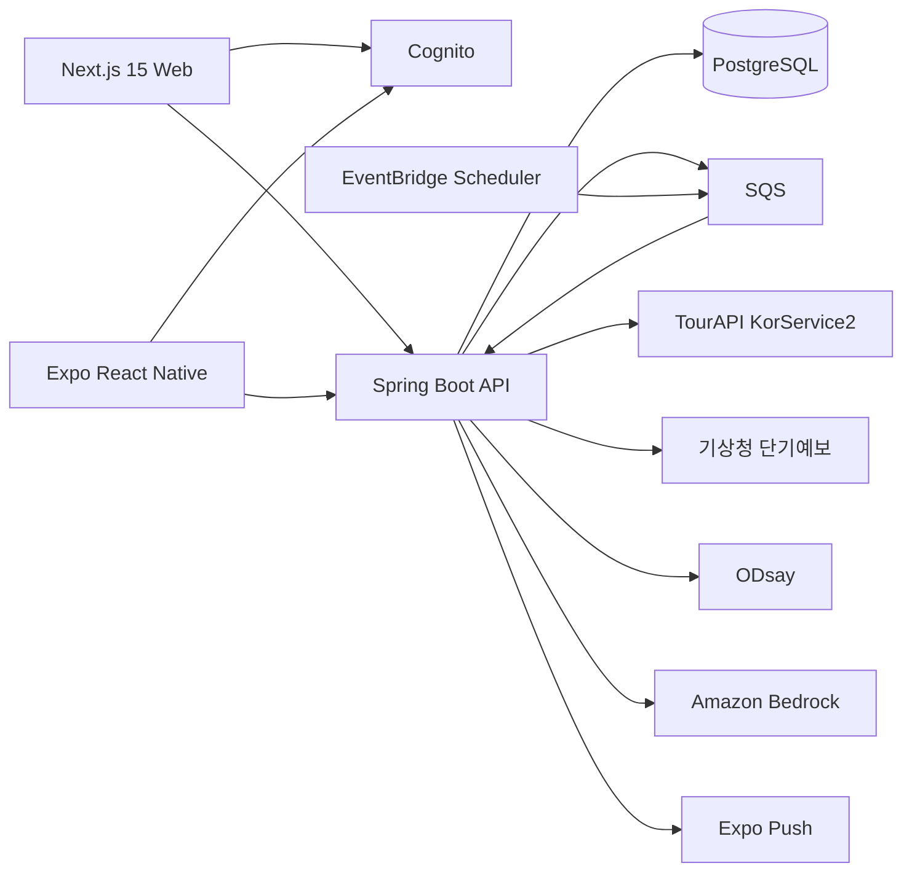

# 시스템 아키텍처

## 1. 목표 구조



웹과 앱은 Spring API만 호출하며 외부 데이터 키와 Bedrock 권한을 클라이언트에 노출하지 않는다.

## 2. 모노레포

```text
apps/
  web/                 Next.js 15 App Router
  mobile/              Expo + Expo Router
services/
  api/                 Java 21 + Spring Boot 4.1 + Gradle
packages/
  api-client/          OpenAPI에서 생성한 TypeScript 클라이언트
  design-tokens/       색상, 간격, 타이포그래피, 의미 토큰
  config/              공통 TypeScript·ESLint 설정
infra/
  cdk/                 AWS CDK TypeScript
docs/
```

Node 패키지는 pnpm workspace와 Turborepo로 관리한다. Spring은 독립 Gradle wrapper를 가지며 루트 명령이 두 빌드 체계를 조정한다.

## 3. 프런트엔드

- Next.js App Router와 Expo Router의 경로 이름을 도메인 기준으로 맞춘다.
- 서버 상태는 TanStack Query, 작은 로컬 UI 상태는 각 플랫폼 기본 상태로 관리한다.
- API 계약은 Spring OpenAPI 문서에서 생성하며 수동 DTO 중복 정의를 금지한다.
- `pnpm generate:api-client`는 환경별 서버 주소를 제외한 OpenAPI 스키마와 `@dajeong/api-client` 타입을 생성하고, `pnpm check:api-client`는 Spring 계약과 커밋된 생성물의 불일치를 차단한다.
- 웹 SSR은 공개 랜딩과 초대 메타데이터에만 사용한다. 로그인 이후 화면은 인증된 클라이언트 데이터 조회를 사용한다.
- 인증은 시스템 브라우저의 Authorization Code+PKCE 흐름을 사용하고 토큰은 웹의 보안 쿠키 또는 앱 SecureStore에 저장한다.

## 4. Spring 모듈형 모놀리스

| 모듈 | 책임 |
| --- | --- |
| `identity` | Cognito subject와 내부 사용자 연결 |
| `trip` | 여행, 멤버, 초대, 권한 |
| `itinerary` | 일정 슬롯과 불변 버전 |
| `preference` | 비공개 응답과 양보 원장 |
| `disruption` | 날씨 감지와 수동 신고 |
| `proposal` | 후보 생성 작업과 외부 API 조정 |
| `voting` | 투표, 마감, 동률 처리, 일정 적용 |
| `notification` | 인앱 알림, 푸시 토큰, outbox |
| `integration` | TourAPI·기상청·ODsay·Bedrock 어댑터와 캐시 |

모듈은 같은 프로세스와 DB를 사용하지만 다른 모듈의 테이블을 직접 수정하지 않는다. 공개 메서드나 도메인 이벤트로만 협력해 후속 ECS 분리가 가능하도록 한다.

## 5. 비동기 처리

- EventBridge가 30분마다 `weather-poll` SQS 메시지를 보낸다.
- EventBridge가 1분마다 `vote-deadline` 메시지를 보내 마감된 후보 세트를 닫고, 매일 `retention-cleanup` 메시지를 보내 보존 기간이 지난 민감정보를 삭제한다.
- API 워커는 향후 24시간 내 활성 여행을 조회하고 대전 격자·예보 발표 시각별로 날씨를 한 번만 가져온다.
- 재조정 요청은 트랜잭션에서 작업 레코드와 outbox를 만들고 `replan-jobs` SQS로 전달한다.
- SQS 메시지는 최소 한 번 전달을 전제로 멱등 키를 사용한다. 실패는 지수 백오프로 재시도하고 최종 실패는 DLQ와 사용자 알림으로 전환한다.
- 초기 Beanstalk에서는 API와 워커가 같은 JAR에서 동작한다. ECS 이전 시 동일 이미지를 API 서비스와 워커 서비스로 분리한다.

## 6. 인증·인가

- Cognito User Pool이 카카오 OIDC, Apple, Google 로그인을 통합한다.
- 웹은 Cognito Authorization Code + PKCE 요청에 API resource identifier를 바인딩하고 access·refresh token을 HttpOnly·SameSite 쿠키에만 저장한다.
- Spring Security Resource Server가 access token의 `iss`, `aud`, `token_use`, 서명, 만료를 검증한다.
- 첫 인증 API 호출에서 Cognito `sub`로 내부 사용자를 생성한다.
- 여행 권한은 매 요청에서 활성 Membership을 조회한다. 클라이언트가 보낸 역할 값은 신뢰하지 않는다.
- 내부 스케줄·워커 요청은 사용자 JWT가 아니라 IAM/SQS 권한으로 분리한다.

## 7. 캐시와 외부 API 보호

- TourAPI 장소 상세는 24시간, ODsay 좌표쌍 경로는 24시간, 기상청 예보는 발표 주기까지 PostgreSQL 캐시에 저장한다.
- 외부 호출에는 짧은 연결·응답 시간 제한, 회로 차단기, 호출량 측정, 공급자별 rate limit을 둔다.
- 외부 응답 원문은 디버깅 기간 7일만 보존하고 키·개인 입력을 제거한다.
- ODsay 일일 호출량 80%, Bedrock 일일 예산 80%에서 운영 알림을 보낸다.

## 8. 관측성

- 모든 요청에 correlation ID를 부여하고 작업·외부 호출까지 전달한다.
- CloudWatch Logs는 구조화 JSON을 사용하되 선호·예산·투표·토큰·프롬프트를 기록하지 않는다.
- 핵심 메트릭은 API p95, 후보 생성 시간, 외부 API 오류율, 큐 지연, DLQ 수, 푸시 실패, 합의 시간이다.

## 9. 기술 근거

- [AWS Amplify의 Next.js SSR 지원 범위](https://docs.aws.amazon.com/amplify/latest/userguide/ssr-amplify-support.html)
- [Spring Boot 4.1 시스템 요구사항](https://docs.spring.io/spring-boot/system-requirements.html)
- [Amazon Cognito 외부 Identity Provider 구성](https://docs.aws.amazon.com/cognito/latest/developerguide/cognito-user-pools-identity-provider.html)
- [카카오 로그인 OIDC](https://developers.kakao.com/docs/ko/kakaologin/utilize)
- [Expo EAS Build](https://docs.expo.dev/build/introduction/)
